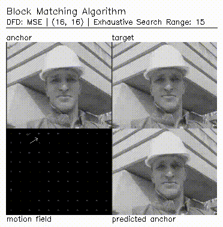

# Homework-1
## Block Matching Algorithm

### [Report](https://001honi.github.io/static/projects/video-processing/block-matching/block_matching.html) follow this site for the results and more.

### Implementation
_BlockMatching()_ class is written in Python. It takes 5 arguments:
<ul>
            <li><strong>dfd :</strong> {0:MAD, 1:MSE} Displaced frame difference </li>
            <li><strong>blockSize :</strong> (sizeH,sizeW) </li>
            <li><strong>searchMethod :</strong> {0:Exhaustive, 1:Three-Step} </li>
            <li><strong>searchRange :</strong> (int) +/- pixelwise range </li>
            <li><strong>motionIntensity:</strong> True (default)  
               <i>Normalization for motion vector intensities. Assigns 255 to the largest amplitude motion vector. 
                 Also, there is a threshold that intensity value cannot be less than 100.</i></li>
</ul>  
In main script, there are two more parameters to control the predictions:
<ul>
            <li><strong>predict_from_prev :</strong> False (default) </li>
            <li><strong>N:</strong> 5 (default)  
               <i>If the predictions made from previous predicted frames, anchor is updated after N frames.</i></li>
</ul>  

### Sample Result

  

